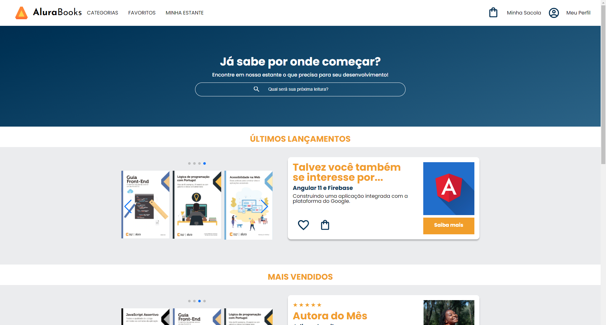

# Bem-vindo ao repositório AluraBooks!

Este repositório foi criado para o curso de HTML e CSS, com o objetivo de aprender técnicas fundamentais para a criação de sites utilizando a responsividade mobile first.

## Tópicos de aprendizagem incluem:

- Construção de um site com HTML e CSS;
- Entenda como interpretar um protótipo de site criado no Figma;
- Conheça a abordagem mobile-first;
- Aprenda a utilizar media queries na construção de layouts responsivos;
- Realize o deploy de um site através do Github Pages;

## 🔨 Funcionalidades do projeto

## ✔️ Técnicas e tecnologias utilizadas

- `HTML`;
- `CSS`;
- `Carrossel com SwiperJS`;
- `Interpretação de protótipo no Figma`;
- `Abordagem mobile-first`;
- `Utilização de media queries para layouts responsivos`;
- `Github Pages`;

## 🛠️ Abrir e rodar o projeto

[AluraBooks](https://micheleascoli.github.io/alura-books/)

## 📚 Mais informações do curso

Curso de HTML e CSS: responsividade com mobile-first

Carga Horária: 12H

- [Alura](https://cursos.alura.com.br/course/html-css-responsividade-mobile-first)
